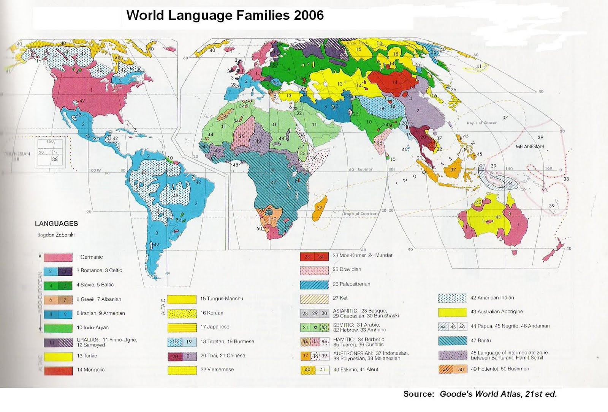

### Hofstede 6 Dimensions

As described by Hofstede. See their website for a [Comparison Tool](https://www.hofstede-insights.com/fi/product/compare-countries/)

### Languages

Also includes languages spoken per country, as per this [2006 Language World Map](https://1.bp.blogspot.com/-e2R2CoAG65w/TdPC3Kzri2I/AAAAAAAACy8/TNdYEBJKNaQ/s1600/WorldLanguageFamiliesMap.jpg)

